<h2 align="center" style="color:#38c2bb;">📚 MarketPress Reloaded</h2>

  <a href="https://github.com/cp-psource/marketpress/discussions" style="color:#38c2bb;">💬 Forum</a>
  <a href="https://github.com/cp-psource/marketpress/releases" style="color:#38c2bb;">⬇️ Download</a>
  <a href="themes.html" style="color:#38c2bb;">🎨 Design</a>
  <a href="readme-en.html" style="color:#38c2bb;">🌐 English</a>

Das einfachste und dennoch mächtigste ClassicPress-E-Commerce-Plugin - Ob kleiner Onlineshop, Digitales Schaufenster, funktioniert auch perfekt mit BuddyPress und Multisite, um einen sozialen Marktplatz zu schaffen, auf dem Du einen Prozentsatz nehmen kannst! Aktiviere das Plugin, passe Deine Einstellungen an und füge Deinem Shop einige Produkte hinzu.

### Verkaufe alles von digitalen Downloads bis hin zu physischen Gütern. MarketPress ist das E-Commerce-Plugin, das alles kann – keine Erweiterungen erforderlich.

MarketPress bietet die einfachste Möglichkeit, alles online zu verkaufen, mit unzähligen integrierten Kernfunktionen und einfacher Konfiguration. Ganz gleich, ob Du eine einzelne Online-Storefront oder ein ganzes E-Commerce-Netzwerk für Geschäfte einrichten möchtest, MarketPress ist die Lösung der Wahl für ClassicPress und Multisite SuperPowers. Führe Kunden durch das Durchsuchen Deiner Produkte, über das Hinzufügen von Artikeln zu ihrem Warenkorb und schließlich bis zur Kasse und Lieferung. Du kannst sogar Aktualisierungen zum Status von Kundenbestellungen bereitstellen.

### Mit Deinem Feedback erstellt

MarketPress ist unser bislang ehrgeizigstes Plugin-Update. Es vereint Hunderte von Stunden Entwicklungszeit mit den Anfragen und dem Feedback der Mitglieder. MarketPress war noch nie einfacher, von der Kundenakquise bis zum Bezahlvorgang, und es wird immer besser.

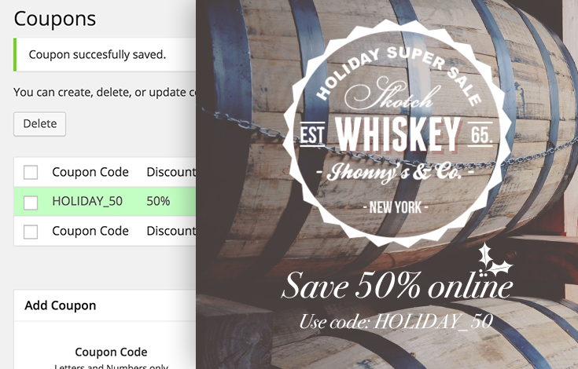

  Gutscheine sind nur ein Beispiel für unseren wachsenden Katalog an Add-ons.

### Alles verkaufen

Egal, ob Du individuelle T-Shirts verkaufen möchtest, die Du selbst in Deiner Garage entworfen und im Siebdruckverfahren gedruckt hast, herunterladbare Kopien der neuesten EP Deiner Band oder sogar Deine Zeit als Berater – MarketPress macht alles möglich.

  Variationen sind leistungsfähiger und einfacher zu verwenden.

### Alle Formen, Größen, Farben und Materialien

Variationen wurden von Grund auf neu geschrieben, sodass Du jetzt unbegrenzt viele Farben, Größen und Materialien für jedes Deiner Produkte erstellen und passende einzigartige Produktbilder hinzufügen kannat. Präsentiere Deine Produkte dann in einer schönen, integrierten Galerie.

### Gebündelte Zahlungsgateways

Akzeptiere Zahlungen über 15 beliebte Zahlungsabwickler, darunter Stripe, PayPal und Authorize.net. Mache es jedem leicht, Dich zu bezahlen. Eine reibungslose Transaktionsabwicklung ist für den Aufbau von Vertrauen und Kundenbindung unerlässlich.

  Weitere integrierte Zahlungsoptionen.

  2Checkout, Authorize.net AIM, gemeinsame eWay-Zahlungen, eWay Rapid 3.1-Zahlungen, manuelle Zahlungen, Mijireh, Mollie, Paymill, PayPal Chained Payments, PayPal Express Checkout, PayPal PayFlow Pro, PIN, Simplify Commerce by MasterCard, Stripe und WePay.

### Alle Kernfunktionen, die Du benötigst

**Wir stellen alle Tools zur Verfügung, die Du benötigst, um Deine Produkte so zu vermarkten, wie Du es möchtest – ohne dass Du für teure Erweiterungen bezahlen musst.**

## 🚀 Features

**Warenkorbverhalten**

Wähle ob Benutzer auf den aktuellen Produktseiten bleiben oder zur Kasse weitergeleitet werden, wenn sie ein Produkt in ihren Warenkorb legen.

**Soziale Einstellungen**

Ermutige Kunden, Ihre Produkte mit ihren Freunden und ihrer Familie zu teilen, indem Du die Share-Buttons auf Pinterest, Facebook und Twitter nutzt.

**Verwalte den Bestellvorgang**

Aktiviere oder deaktiviere den Gast-Checkout und verkaufe sogar in bestimmte Länder oder an jeden auf der Welt.

**Digitale Downloads beschränken**

Wähle aus, wie oft ein Kunde eine gekaufte Datei herunterladen kann.

**Einseitiger Checkout**

Wusstest Du, dass die Wahrscheinlichkeit, dass der durchschnittliche Kunde seinen Warenkorb verlässt, bei 69 % liegt? Mit unserem einfachen neuen One-Page-Checkout-Prozess wirst Du nicht zu einer weiteren Statistik.

**Automatische Steuern**

Einfache Steuereinstellungen erleichtern das Festlegen von Tarifen, das Erstellen von Ausnahmen, die Erhebung von Steuern auf herunterladbare Produkte, Steuern vor oder nach den Versandkosten und Steuern je nach Standort.

**Überall versenden**

Versende mit Zuversicht überall auf der Welt. Nutze Flatrate-Versandkosten oder richte Dich mit Tabellen- oder Gewichtstarifen nach einer spezifischen Distributionslogistik.

**Nicht vorrätige Produkte ausblenden**

Wenn ein Produkt nicht verfügbar ist, lege es automatisch als Entwurf fest, damit es nicht angezeigt wird.

**Produktanzeige**

Zeige Deine Produkte als Liste oder Raster an, wähle die Anzahl der Zeilen, zeige Bilder an (oder auch nicht) und nutze die integrierte Bild-Lightbox optimal.

**Google Analytics**

Wir haben dafür gesorgt, dass Deine gesamte Webseite oder Dein gesamtes Netzwerk sowohl mit Google Universal Analytics als auch mit Google Analytics eCommerce kompatibel ist.

**Standardwährung festlegen**

Wähle aus 120 verschiedenen Währungen als Standardwährung. Du kannst Kunden auch erlauben, ihre Punkte oder Guthaben standardmäßig in Deinem Shop einzulösen.

**Ähnliche Produkte anzeigen**

Verleite Kunden zu mehr Käufen, indem Du verwandte Produkte anzeigst. Wähle aus, wie viele angezeigt werden sollen, wähle eine Liste oder ein Raster aus und lege fest, ob Produkte nach Kategorien oder Tags verknüpft werden sollen.

**Shortcodes**

Mit einer praktischen Schaltfläche im visuellen Beitragseditor kannst Du schnell Shortcodes in ein Produkt, eine Seite oder einen Beitrag einfügen.

**Bestandswarnung**

Wenn Dir eines Deiner Produkte ausgeht, kann MarketPress Dich darüber informieren, wann es Zeit ist, Deine Vorräte aufzufüllen.

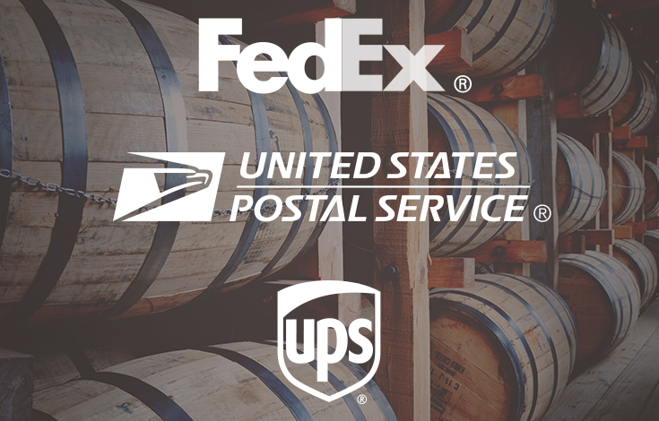

  Sorge für den richtigen Versand – binde ihn direkt an FedEx, UPS oder USPS an.

### Einfacher, intuitiver und noch leistungsfähiger

MarketPress bietet eine mühelose und benutzerfreundliche Lösung für die Einrichtung eines Online-Shops, auch für Erstbesitzer eines Shops. Von Produkt- und Shopeinstellungen bis hin zu Zahlungsgateways, Versand und Produktanzeige – die Einrichtung Deines Shops mit MarketPress nimmt keine Zeit in Anspruch.

### Schnelleinrichtungsassistent

Durch die schnelle Einrichtung ist Deine Webseite in wenigen Minuten bereit für den Verkauf von Produkten und digitalen Downloads. MarketPress führt Dich Schritt für Schritt durch die Einrichtung Deines Shops, sodass Du nicht darüber nachdenken musst, was sich hinter den Kulissen abspielt (wenn Du jedoch wissen möchtest, was sich hinter den Kulissen abspielt, kannst Du das trotzdem tun).

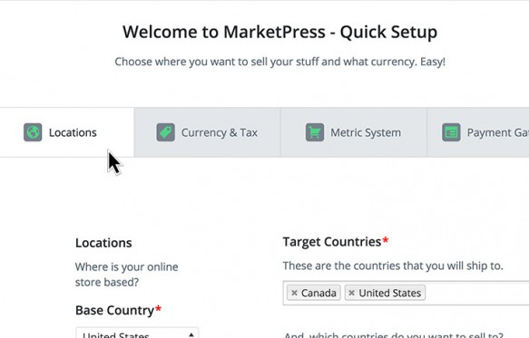

  Beginne schnell mit dem Verkauf mit der Kurzanleitung zur Einrichtung.

### Größere Funktionalität mit Add-Ons

**MarketPress bringt Add-ons mit, es werden noch weitere hinzukommen.**

_Coupons_ Gewinne neue Käufer und steigere den Umsatz mit Coupon-basierten Marketingkampagnen.

_PDF-Rechnung_ Ermögliche Benutzern die Erstellung einer ansprechenden Rechnung anstelle oder zusätzlich zu einer Standard-Rechnungs-E-Mail.

### Die komplette Upfront-Storefront

Verwende ein beliebiges [Upfront-Starter-Theme](https://cp-psource.github.io/upfront/), um schnell einen schönen Online-Marktplatz einzurichten, oder erstelle mit [UpFront-Builder](https://cp-psource.github.io/upfront-builder/) eine vollständig benutzerdefinierte Storefront. Upfront enthält alle MarketPress-Seitenlayouts, die Du zum Ziehen, Skalieren und Positionieren Deines Shops in Echtzeit benötigen.

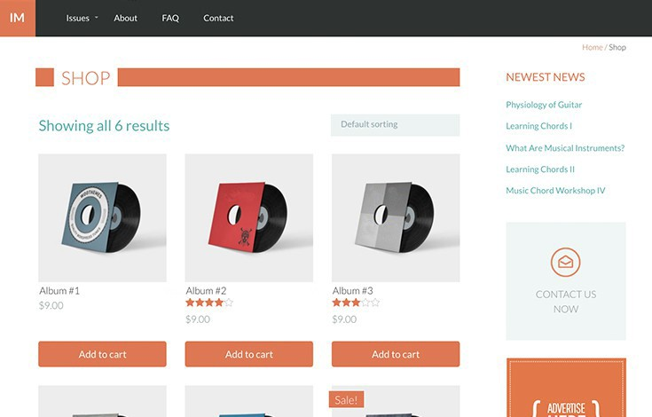

  Upfront verfügt über integrierte MarketPress-Stile, sodass Du in wenigen Minuten einen E-Commerce-Shop einrichten kannst.

  MarketPress passt sich Deinem Design an.

### Automatisches adaptives Design

Wir haben nicht nur unsere eigenen Themes erstellt, um das Design zu vereinfachen, MarketPress ist auch so entwickelt, dass es einwandfrei mit jedem gut codierten ClassicPress-Theme funktioniert. Mithilfe von Shortcodes und integrierten Widgets kannst Du Elemente überall auf Deiner Webseite anzeigen.

### Integration mit PSOURCE-Plugins

Nutze die gut 80 PSOURCE-Plugins, voll aus, indem Du sie mit MarketPress koppelst. Darüber hinaus umfasst MarketPress spezielle Integrationen mit [Terminmanager](https://cp-psource.github.io/terminmanager-pro/) und [BrainPress](https://cp-psource.github.io/brainpress/).

## ⚙️ Schnelleinstieg

### So startest Du:

Sobald Du MarketPress installiert und aktiviert hast, wird Dir unser Schnelleinrichtungsassistent angezeigt. Du kannst es überspringen, wenn Du _wirklich_ möchtest, aber wir empfehlen Dir dringend, es vollständig durchzugehen (da es die Einrichtung Deines Shops einfacher macht):

  Wir beginnen mit der Erstellung der Store-Seiten und von dort aus konfigurierst Du Dinge wie:

* Der Standort Deines Geschäfts
* Deine Versandpräferenzen (Wohin Du versendest und welche Versandmethoden Du verwendest)
* Die Währungs- und Steuereinstellungen Deines Shops
* Zahlungsgateways (wir haben eine Menge davon!)

Sobald Du das alles konfiguriert hast, hast Du die Möglichkeit, entweder ein neues Produkt zu erstellen oder die Einstellungen genauer durchzugehen:

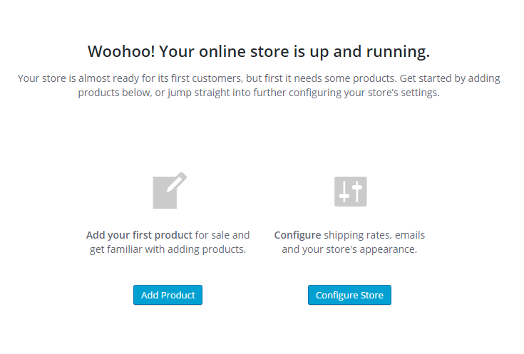

  Bevor wir hier ein Produkt erstellen, möchten wir zunächst einige Aspekte der Einstellungen ansprechen.

### Ein Spaziergang durch den Shop... Einstellungen

Unser Freund, die Registerkarte „Shopeinstellungen“, enthält alle Einstellungen für MarketPress:

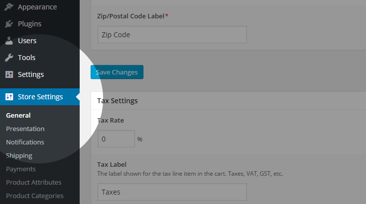

  Wir stellen eine Inline-Dokumentation für alle Einstellungen innerhalb von MarketPress bereit, möchten jedoch bei der Einrichtung dieses neuen Shops insbesondere auf einige Punkte eingehen. **Digitale Downloads** Wenn Du vorhast, digitale Produkte in Deinem Shop anzubieten, solltest Du den Abschnitt „Download-Einstellungen“ unter „Store-Settings“ -> „Allgemein“ lesen.

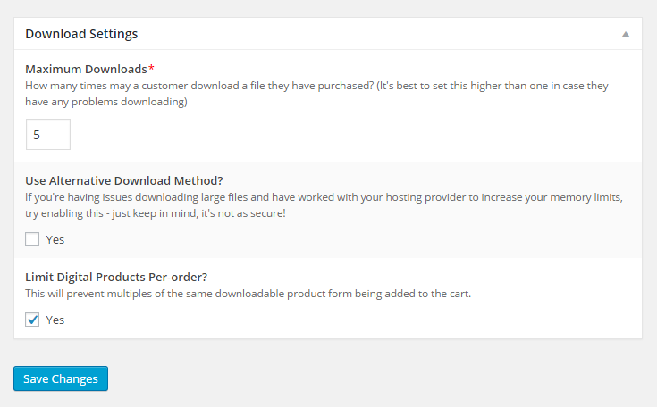

  Von hier aus kannst Du Folgendes wählen:

* Lege fest, wie oft eine gekaufte Datei maximal heruntergeladen werden kann
* Aktiviere die alternative Download-Methode von MarketPress (für große Downloads, z.B. Dateien mit einer Größe von mehreren hundert Megabyte).
* Begrenze die Anzahl digitaler Produkte pro Bestellung

**Google Analytics E-Commerce-Tracking** Wenn Du Google Analytics bereits auf Deiner Webseite verwendest, wird es Dich freuen zu erfahren, dass wir eine Integration damit in MarketPress anbieten, sodass Du auch Deine E-Commerce-Aktivitäten verfolgen kannst (ohne dass Add-Ons erforderlich sind)! Die Einstellungen für diese Integration findest Du auch unter: _Store-Settings -> Allgemein_

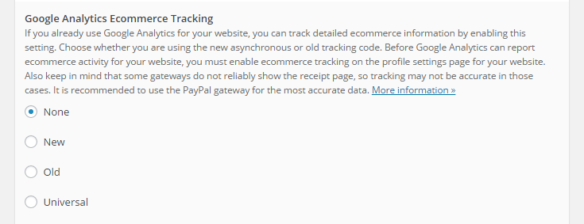

  Von dort aus kannst Du MarketPress so konfigurieren, dass es mit dem auf Deiner Webseite verwendeten Tracking-Code funktioniert (unabhängig davon, ob Du den alten, neuen oder universellen Tracking-Code verwendest). **Store-Seiten** Wenn Du den Schritt weiter oben in der Schnelleinrichtung zum Erstellen der Store-Seiten übersprungen hast, solltest Du unbedingt zum Abschnitt „Store-Seiten“ unter: _Store-Settings -> Präsentation_ gehen und diese Seiten einrichten. Du kannst für jede Shop-Seite auf die Schaltfläche „Seite erstellen“ klicken und MarketPress erstellt automatisch eine Seite für Dich:

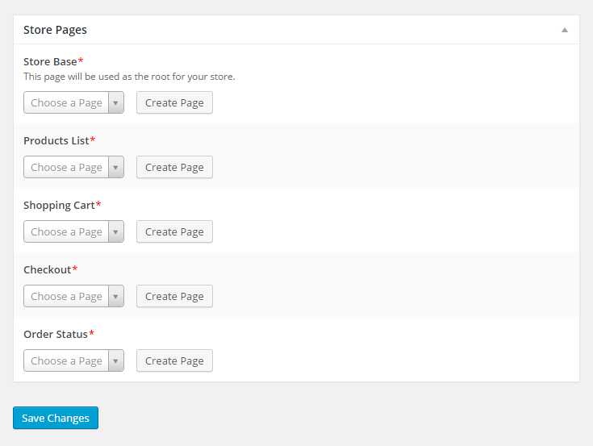

  **Produktattribute** In MarketPress werden diese auch als Variationen bezeichnet (auf die wir später eingehen). In diesem Abschnitt kannst Du verschiedene Attribute für Deine Produkte erstellen und ändern (z.B. Farbe, Größe, Gewicht usw.). Du kannst auch die Art und Weise der Sortierung und die Sortierung anpassen und sogar neue Optionen zu einem vorhandenen Attribut hinzufügen. **Produktkategorien/Produkt-Tags** Da Du mit ClassicPress Kategorien und Tags für Deine Beiträge erstellen kannst, kannst Du mit MarketPress über die Einstellungsseiten „Produktkategorien“ und „Produkt-Tags“ dasselbe für Deine Produkte tun. Denn wenn es um die Bereitstellung von Produkten geht, möchte man es dem Kunden möglichst einfach machen, das zu finden, was er sucht. **Funktionen** Dieser Abschnitt ist praktisch, wenn Du steuern möchtest, wie andere Deinen Shop verwalten können, oder sogar jemandem erlauben möchtest, Deinen gesamten Shop zu verwalten, ohne ihn zum Administrator Deiner Webseite machen zu müssen! Tipp: Wenn Du eine spezielle Rolle für einen Shop-Administrator erstellen möchtest, kannst Du dazu ein Plugin wie [Benutzerrollen-Editor](https://wordpress.org/plugins/user-role-editor/) verwenden (Eine einfache Möglichkeit wäre, die Rolle „Abonnent“ zu duplizieren und dann einfach die gewünschten Berechtigungen auf der Seite „Funktionen“ in MarketPress zuzuweisen.) Wir werden uns später noch mit einigen anderen Einstellungen befassen, aber zunächst einmal erstellen wir unser erstes Produkt!

### Produkte erstellen

Im MarketPress stehen drei Arten von Produkten zur Verfügung: physische, digitale und externe Produkte. Wir beginnen hier mit einem physischen Produkt (in diesem Beispiel einem T-Shirt), gehen die verschiedenen Aspekte der Konfiguration durch und gehen dann auf die einzigartigen Aspekte sowohl digitaler als auch externer Produkte ein. Als erstes auf unserer Agenda steht der Abschnitt „Produktart“, in dem Du die Art des zu erstellenden Produkts auswählen kannst. Für unseren Beispielfall haben wir hier bereits den Typ „Physisches / materielles Produkt“ ausgewählt:

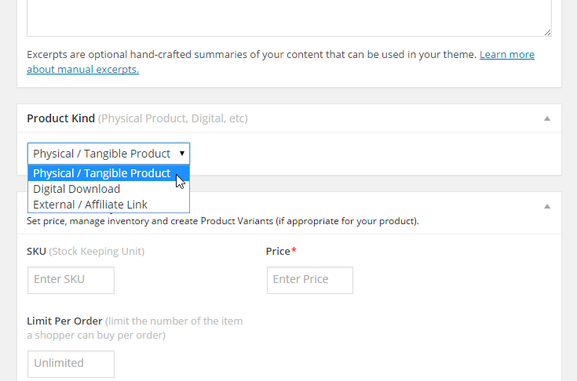

  Als nächstes haben wir den Abschnitt „Preis, Lagerbestand und Varianten“. Abhängig von der im Abschnitt „Produktart“ ausgewählten Produktart variieren die hier angezeigten Optionen. Nachfolgend findest Du die Optionen, die Dir beim Erstellen eines physischen Produkts angezeigt werden:

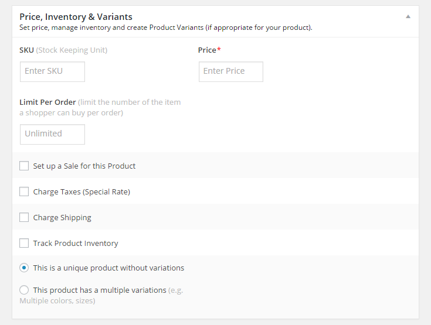

  Da wir derzeit ein physisches Produkt einrichten, gibt es in diesem Abschnitt einige Punkte zu beachten: _Richte einen Verkauf für dieses Produkt ein:_ Wenn Du planst, einen Verkauf für dieses Produkt durchzuführen, solltest Du dies tun um diese Option zu aktivieren. Außerdem kannst Du den Zeitraum angeben, für den dieser Verkauf gilt! _Sondersteuern:_ Wenn für Dein Produkt ein anderer Steuersatz als in Deinen allgemeinen Einstellungen angegeben erforderlich ist, gib hier den gewünschten Steuersatz ein. _Versandkosten berechnen:_ Wenn Du Versandkosten berechnest, solltest Du dieses Kontrollkästchen auf jeden Fall aktivieren, da Du dann das Gewicht für Dein Produkt angeben kannst (und ggf. eine zusätzliche Versandkostenpauschale). _Produktbestand verfolgen:_ Hier kannst Du eine Menge für Dein Produkt festlegen (und Du kannst Kunden sogar erlauben, das Produkt zu kaufen, wenn es nicht vorrätig ist). Etwas unterhalb dieses Abschnitts siehst Du nun auch den Abschnitt „Produktbilder“:

  Hier kannst Du ein oder mehrere Bilder für Dein Produkt angeben (das erste Bild wird als Hauptbild verwendet), die dann als Galerie auf Deiner Produktseite angezeigt werden. **Variationen** Ah, Variationen... damit wirst du viel Spaß haben. :) Anstatt mehrere Produkte für jeden Produkttyp zu erstellen (z. B. Herrenhemden, Damenhemden, weiße Hemden usw.), kannst Du diese in Variationen innerhalb eines einzigen Produkts umwandeln! Wenn wir unser T-Shirt-Produktbeispiel hier fortsetzen, könntest Du eine Version für Frauen und eine andere für Männer haben. Oder, um eine weitere Variante hinzuzufügen, könntest Du T-Shirts für Männer und Frauen sowie kleine, mittlere und große Größen anbieten. Oder um noch eine weitere Variante in den Mix einzubringen, könntest Du T-Shirts für Männer und Frauen in kleinen, mittleren und großen Größen anbieten, _und_ auch in einer Reihe von Farboptionen! Wie Du siehst, gibt es viele Möglichkeiten! :) Im Feld „Variationen hinzufügen für“ kannst Du so viele Namen und Werte erstellen, wie Du möchtest (oder bereits erstellte auswählen, wenn Du dies über die zuvor erwähnte Seite „Produktattribute“ getan hast), indem Du den dortigen Anweisungen folgst: 

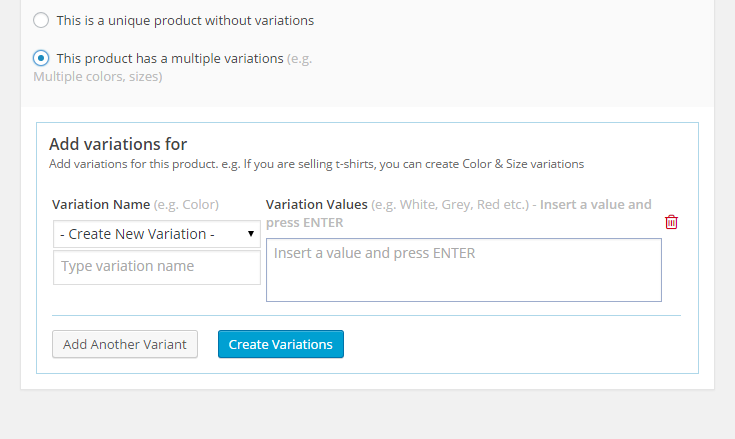

  Sobald die Variationen erstellt/ausgewählt wurden, wirst Du feststellen, dass die Abschnitte „Preis, Lagerbestand und Varianten“ und „Produktbild“ verschwinden und durch den Abschnitt „Produktvariationen“ ersetzt werden:

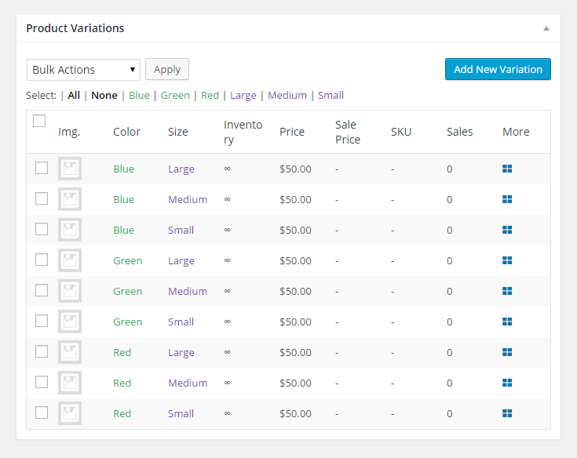

  Von hier aus kannst Du alle Deine Variationen bearbeiten, von der Anpassung des Lagerbestands über die Änderung des Variationstyps bis hin zur Änderung der Preise usw. Ganz links in diesem Abschnitt kannst Du für jede Variation ein Produktbild angeben Variation aufführen. Im Abschnitt „Mehr“ für eine Variante (dargestellt durch ein blaues Gitter ganz rechts) kannst Du einige zusätzliche Eigenschaften für die Variante anpassen, die Du zuvor im Abschnitt „Preis, Lagerbestand und Varianten“ gesehen hast:

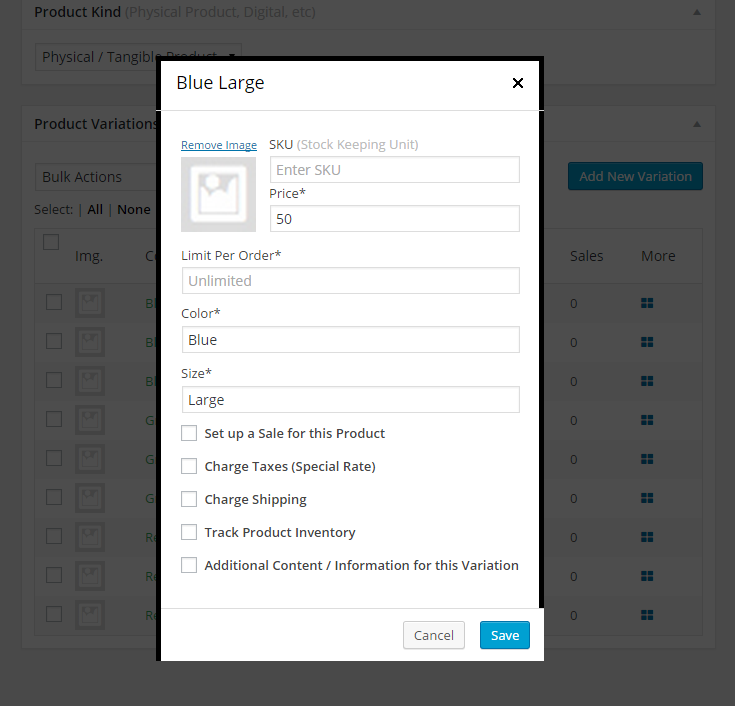

  Wenn Du möchtest, kannst Du auch einige zusätzliche Inhalte für die Variation aus diesem Abschnitt hinzufügen. **Ähnliche Produkte** Lasse uns nun in die Zukunft blicken und sagen, dass Dein Kunde auf Deiner Produktseite ist und sich Deine T-Shirts ansieht. Aber während er dort ist, sieht er in der Rubrik „Ähnliche Produkte“ … ein Kleid aus Deinem Geschäft, zusammen mit einer gepunkteten Krawatte und Clogs! Was wäre, wenn dort stattdessen eine Jeans, ein paar Turnschuhe und eine Baseballkappe auftauchen würden? Mit dieser Einstellung kannst Du bestimmte Produkte in Deinem Shop auswählen, die im Abschnitt „Ähnliche Produkte“ angezeigt werden, sodass Du Deinen Kunden nun zum Kauf einer kompletten Garderobe verleitest, statt einer unpassenden Auswahl an Artikeln:

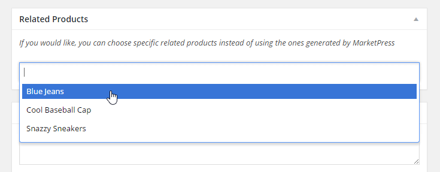

  Herzlichen Glückwunsch, Du hast gerade die Zukunft gerettet! (und das alles ohne Zeitmaschine) **Kategorien und Tags** Schließlich kannst Du Kategorien und Tags zuweisen, die Du für Deine Produkte erstellt hast, sowie neue Kategorien und Tags erstellen, die Du zuweisen möchtest. Mache Deine Produkte einfach zu sortieren und zu finden, und Deine Kunden werden es Dir danken. **Bei digitalen Produkten** Bei digitalen Produkten können auch Variationen angegeben werden, aber anstatt uns um Versanddetails zu kümmern, müssen wir stattdessen eine Datei von Deiner Webseite angeben, die dem Produkt zugewiesen werden soll. Wie physische Produkte können auch digitale Produkte Variationen haben, wobei jeder Variation eine eigene Datei zugeordnet ist. Wenn Du also Steuervorbereitungssoftware verkaufst, kannst Du die Basic-, Premium- und Pro-Editionen der Software anbieten, jede Edition als separate Variante. **Bei externen Produkten** Bei externen Produkten besteht der einzige Zweck darin, Deinen Kunden an einen externen Ort zu leiten (z. B. einen Affiliate-Link, einen anderen Shop usw.), daher sind die Optionen hier minimal. Hier können eine SKU, ein Preis und ein Produktbild sowie ein Verkaufspreis festgelegt werden. Der Schwerpunkt liegt jedoch auf dem Feld „Externer Link“, in dem Du den Link zu der Seite eingibst, auf die Du Deinen Kunden weiterleiten möchtest.
  (Wir planen für ein zukünftiges Update ein selbst Beschriftbares Label für dieses Szenario)

### Shortcodes

Okay, Du hast Deine Produkte erstellt, aber jetzt möchtest Du sie auf mehr als nur Deinen Produktseiten zeigen. Möglicherweise möchtest Du ein einzelnes Produkt auf einer Deiner Seiten anzeigen oder auf einer Deiner Seiten eine Liste von Produkten anzeigen, die zu einer bestimmten Kategorie gehören. Keine Angst, wir haben einen praktischen Shortcode-Generator im Editor, der über die im Screenshot unten hervorgehobene Schaltfläche „E-Commerce-Shortcode hinzufügen“ verfügbar ist:

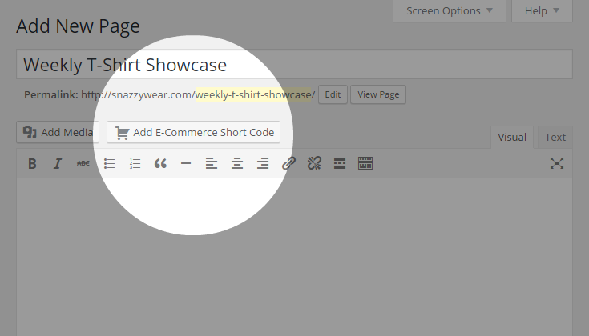

  Wenn Du darauf klickst, wird ein Popup angezeigt, in dem Du über ein Dropdown-Menü einen der verfügbaren Shortcodes auswählen können:

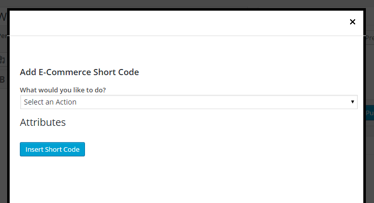

  Wenn ein Shortcode ausgewählt ist, erhältst Du durch Klicken auf die einzelnen „i“-Symbolblasen zusätzliche Informationen zu einem Attribut. Du solltest also darauf klicken, wenn Du nicht ganz sicher bist, was eine Eigenschaft bewirkt.

### Bestellverlauf

Du hast jetzt also Bestellungen von allen Toms, Dicks und Harrys... lasst uns sie verwalten! Von _Store -> Bestellungen_ aus kannst Du alle Bestellungen verwalten und überprüfen, die auf Deiner Webseite aufgegeben wurden:

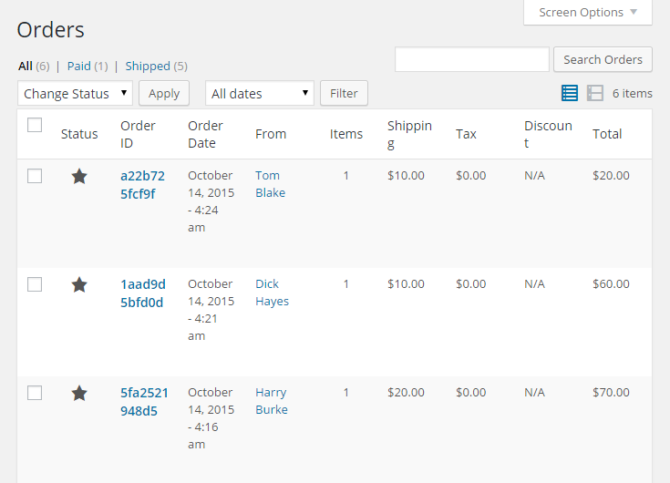

  Indem Du mit der Maus über das Sternsymbol einer Bestellung fährst, kannst Du den Status einer Bestellung schnell ändern:

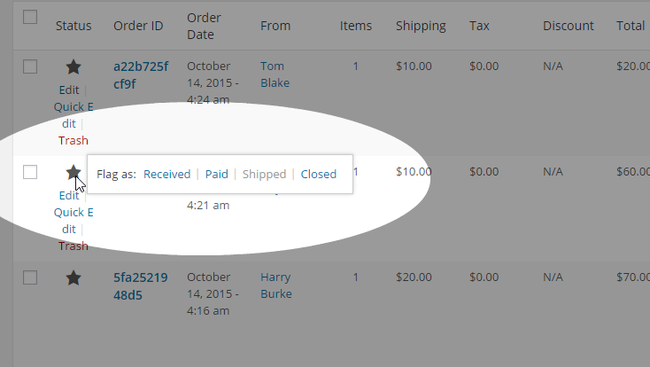

  Du kannst eine Bestellung auch im Detail überprüfen, indem Du auf den Link „Bearbeiten“ für eine bestimmte Bestellung klickst. Dort siehst Du Details wie:

* Informationen zum Kunden
* Die gewählte Zahlungsmethode und die dazugehörigen Details
* Die Versand- und Zahlungshistorie
* Die Versandinformationen (Versandkosten, Versandart und Sendungsverfolgungsnummer).

### Add-Ons

Zu finden unter: Store-Settings -> Add-Ons. Du siehst die in MarketPress verfügbaren Add-Ons, die variieren, je nachdem, ob Du eine normale ClassicPress-Site oder eine Multisite-Installation ausführst. Für das Add-on „Gutscheine“ siehst Du im Menüpunkt „Store“ einen neuen Untereintrag, über den Du neue Gutscheine erstellen kannst:

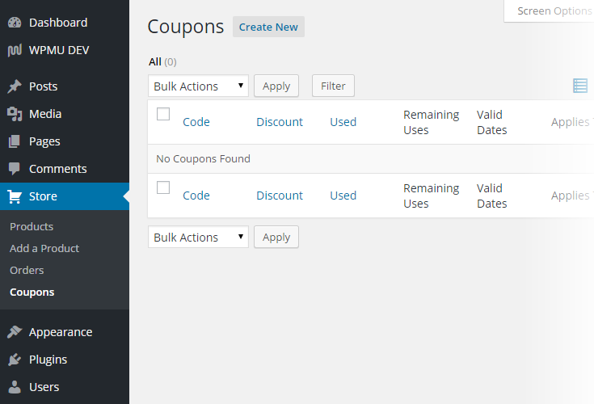

  Wenn Du einen eigenen Gutschein erstellst, wirst Du feststellen, dass es zwei bemerkenswerte Funktionen gibt:

1. Wie soll der Rabattbetrag angewendet werden? - Hierfür kannst Du festlegen, ob:
     * Auf jedes teilnahmeberechtigte Produkt sollte ein Gutschein angewendet werden, unabhängig von der Menge.
     * Ein Gutschein sollte nur einmal pro berechtigtem Produkt angewendet werden (z. B. wenn Du 10 Schachteln Pralinen bestellst, wird nur auf die erste Schachtel der Rabatt angewendet).
2. Kann dieser Gutschein mit anderen Gutscheinen kombiniert werden? - Ja, bei uns kannst Du selbst bestimmen, ob Gutscheine mit anderen Gutscheinen kombinierbar sind! (und um näher anzugeben, mit welchen anderen Gutscheinen ein Gutschein kombiniert werden kann)

Um die Coupon-Nachricht zu konfigurieren, die Kunden auf der Checkout-Seite angezeigt wird, klicke auf der Add-Ons-Seite auf den Link „Einstellungen“ für das Add-on „Gutscheine“. Mit dem Add-on „Rechnungs-PDF“ kannst Du nicht nur automatisch eine PDF-Rechnung mit Deinen Bestell-E-Mails versenden (und E-Mails auswählen, für die die Rechnung automatisch versendet werden soll), sondern auch die Rechnung manuell herunterladen eine PDF-Rechnung für eine Bestellung sowie den Lieferschein für eine Bestellung auf der Seite „Bestelldetails“: 

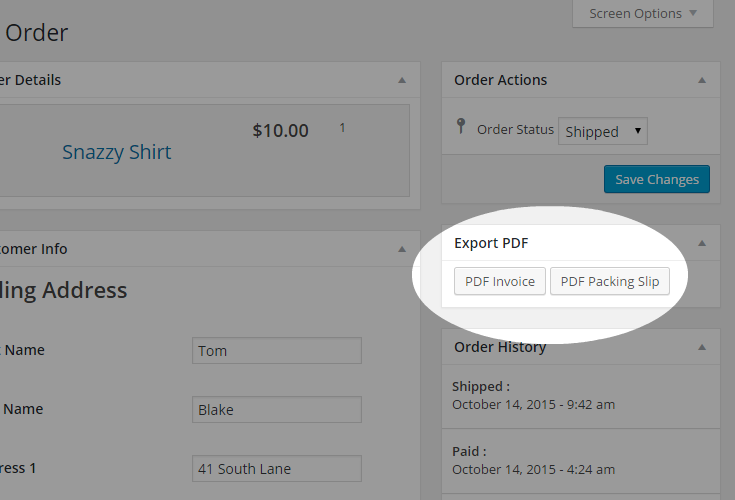

  Das Rechnungs-PDF-Add-on verfügt außerdem über eine eigene Einstellungsseite, auf die Du über die Seite „Add-ons“ zugreifen kannst. Dort kannst Du Dinge konfigurieren wie:

* Wie das PDF angezeigt werden soll
* An welche E-Mails soll es angehängt werden?
* Ob es für kostenlose Produkte deaktiviert werden soll oder nicht
* Sowie Vorlageneinstellungen für die Rechnung selbst

### Verwendung auf ClassicPress Multisite

Auf Multisite kannst Du MarketPress auf eine von zwei Arten aktivieren: **Weg Nr. 1: MarketPress Site für Site aktivieren** Du würdest diesen Weg wählen, wenn Du daraus ein [PS Bloghosting](https://cp-psource.github.io/ps-bloghosting/) Premium-Plugin machen wolltest oder Du willst es auf bestimmte Webseiten beschränken. Das bedeutet für Deine Benutzer:

* Du kannst MarketPress in den Dashboards Deiner Unterseiten über _Plugins -> Installierte Plugins_ aktivieren.
* Du kannst jedes der in MarketPress verfügbaren Zahlungsgateways aktivieren.

**Weg Nr. 2: Netzwerkaktivierung von MarketPress** Hier kann MarketPress auf Multisite wirklich glänzen. Mit dieser Aktivierungsmethode verwandelst Du MarketPress von einem Shop-by-Shop-Erlebnis in ein netzwerkweites Erlebnis! Du kannst Dinge tun wie:

* Verfüge über einen einzigen, globalen Warenkorb, sodass Besucher Deines Netzwerks Artikel aus jedem Shop im Netzwerk hinzufügen und an einem einzigen Ort bezahlen können
* Berechne einen Prozentsatz des Gewinns aus einem Verkauf über das PayPal Chained Payments-Gateway
* Kontrolliere den Zugriff auf Gateways und CSS-Themes innerhalb von MarketPress

Du findest alle Multisite-Optionen im Netzwerk-Dashboard unter: _Einstellungen -> Shop-Netzwerk_

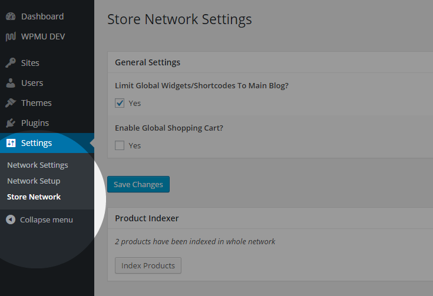

  Hier siehst Du die folgenden Abschnitte:

* Allgemeine Einstellungen – Beschränke die Verwendung globaler Widgets und Shortcodes auf den Hauptblog und aktiviere den globalen Warenkorb
* Produktindexer – indiziere alle Produkte in Deinem Netzwerk, sodass sie auf dem globalen Markt sichtbar sind
* Gateway-Berechtigungen – Bereitstellung oder Einschränkung des Zugriffs auf Zahlungsgateways für Netzwerkshops (eine zusätzliche PS Bloghosting-Option wird bereitgestellt, wenn das [PS Bloghosting](https://cp-psource.github.io/ps-bloghosting/) Plugin installiert ist, mehr dazu gleich)
* Globale Marktplatzseiten – Passe Deinen globalen Marktplatz, Deine Kategorie- und Tag-Seiten an
* Theme-Berechtigungen – Gewähre oder beschränke den Zugriff auf MarketPress-CSS-Themes für Netzwerkshops

_Wichtig:_ Wenn die Webseiten-Sichtbarkeit einer Unterseite in Deinem Netzwerk auf „Suchmaschinen blocken…“ eingestellt ist (unter Einstellungen -> Lesen), werden die Produkte dieser Unterseite nicht auf dem globalen Marktplatz angezeigt.

### Der globale Warenkorb und verkettete Zahlungen

Der globale Einkaufswagen in MarketPress ist von Grund auf so konzipiert, dass jedes Geschäft ein anderer Händler sein kann, der Bestellungen unabhängig annimmt und bearbeitet, den Kunden jedoch einen einzigen Ort im Netzwerk zum Auschecken bietet. Es ist jedoch nicht dafür gedacht, dass ein und derselbe Ladenbesitzer mehrere Geschäfte betreibt. In diesem Fall solltest Du Deine Produkte einfach in einem Geschäft aufbewahren. Zwei Dinge, die Du beim globalen Warenkorb beachten solltest, sind:

1. Aufgrund von domänenübergreifenden Sicherheitsbedenken ist der globale Warenkorb nicht mit domänenbezogenen Unterseiten kompatibel.
2. Wenn der globale Warenkorb aktiv ist, steht im Netzwerk nur das PayPal Express Checkout-Gateway zur Nutzung zur Verfügung.

Nun zu verketteten Zahlungen (auch bekannt als [parallele Zahlungen](https://developer.paypal.com/webapps/developer/docs/classic/express-checkout/integration-guide/ECParallelPaymens/ „Parallelzahlungen“)). . Sie ermöglichen es einem Kunden, eine Bestellung einmal zur Kasse zu gehen/zu bezahlen und das Geld dann automatisch an mehrere Händler auf einem Marktplatz zu verteilen. Im Fall von MarketPress stellen wir dies über das PayPal Chained Payments-Gateway bereit, sodass Du als Eigentümer des Filialnetzwerks Deinen Anteil am Gewinn für einen Verkauf einsammeln kannst, während Deinen Ladenbesitzern der Rest zugesandt wird.

  _Wichtig:_ Bitte beachte, dass die Funktion für verkettete Zahlungen nur über PayPal verfügbar ist.

### PS Bloghosting-Integration

Mit Hilfe unseres eigenen [PS Bloghosting](https://n3rds.work/piestingtal_source/ps-bloghosting-multisite-next-level-plugin/)-Plugins kannst Du den Zugriff auf bestimmte Gateways und CSS-Themes innerhalb von MarketPress auf einfache Weise steuern Eine feinere Art und Weise erfordert, dass ein Benutzer zunächst über ein bestimmtes PS Bloghosting-Level verfügt. Installiere und konfiguriere einfach PS Bloghosting in Deinem Netzwerk und richte verschiedene Ebenen nach Deinen Wünschen ein. Sobald Du das getan hast, gehe zum Dashboard der Hauptseite und gehe zu: _Store-Settings -> Add-ons_ und aktiviere von dort aus das PS Bloghosting-Add-on. Auf der Seite „Store-Netzwerk“ im Netzwerk-Dashboard siehst Du nun im Dropdown-Feld weitere Optionen für den Zugriff, in denen die von Dir konfigurierten PS Bloghosting-Ebenen angezeigt werden:

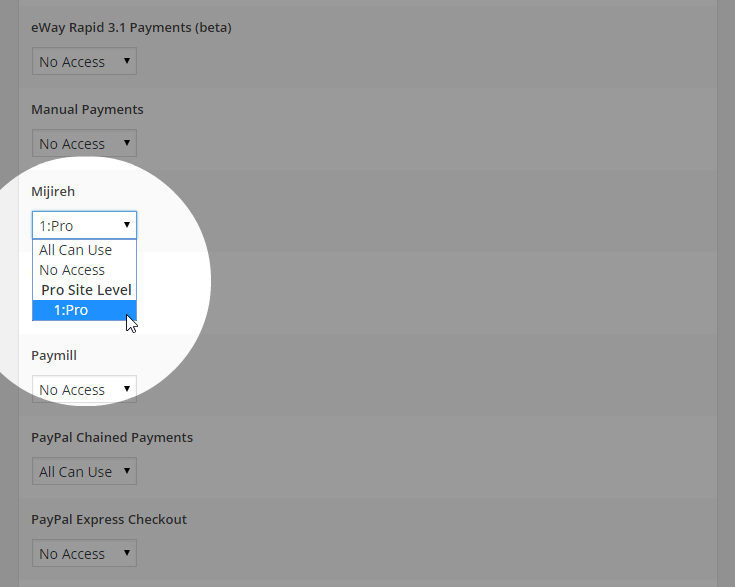

### Hinweis zum Caching

Wenn Du ein Caching-Plugin wie W3 Total Cache verwendest oder einen anderen Caching-Mechanismus wie Varnish auf Deinem Server aktiviert hast, musst Du einige Cookie-Ausnahmen hinzufügen, damit MarketPress ordnungsgemäß funktioniert:

* PHPSESSID
* mp_order_history_
* mp_session
* mp_globalcart_*

Wenn Du W3 Total Cache verwendest, möchtest Du diese zur Einstellung „Abgelehnte Cookies“ hinzufügen (ein Element pro Zeile) unter: _Leistung -> Seiten-Cache -> Erweitert_ Wenn Dein Server Varnish-Cache verwendet, wende Dich bitte an Dein Hosting Bitte Deinen Anbieter, diese Ausnahmen hinzuzufügen.

